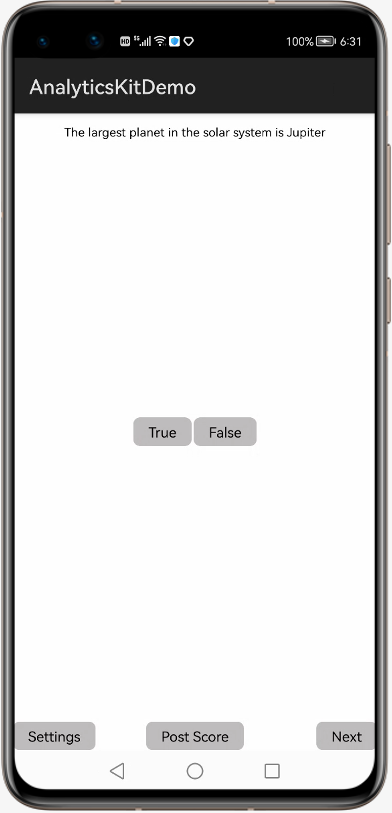
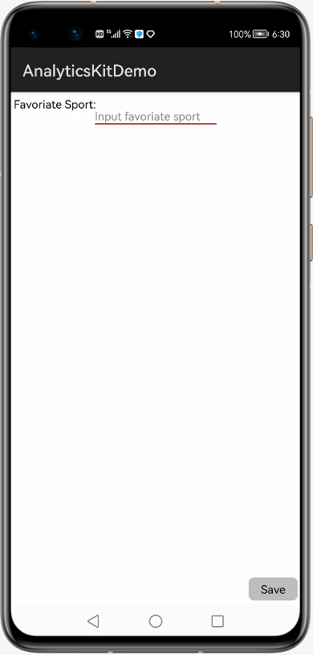

# HUAWEI AnalyticsKit Demo for HarmonyOS

English | [中文](README_ZH.md)

## Table of Contents

* [Introduction](#introduction)
* [Getting Started](#getting-started)
* [Installation](#installation)
* [Configuration ](#configuration )
* [Environment requirements](#environment-requirements)
* [Result](#result)
* [License](#license)

## Introduction
AnalyticsKitDemo provides an example of integrating HUAWEI Analytics Kit with an `Hap`. It illustrates how to collect predefined events and custom events to improve user engagement and user preference.
[Read more about Analytics Kit](https://developer.huawei.com/consumer/en/doc/development/HMSCore-Guides/introduction-0000001050745149).

## Getting Started

For more development guidance, please refer to the links below:

[Development Guide](https://developer.huawei.com/consumer/en/doc/development/HMSCore-Guides/introduction-0000001050745149).

[API References](https://developer.huawei.com/consumer/en/doc/development/HMSCore-References/overview-0000001077819400).

In this example, we demonstrate how to use the analytics SDK for HarmonyOS by using the Gradle build system.

First download AnalyticsKitDemo by cloning this repository or downloading an archived snapshot.

In HUAWEI DevEco Studio, click Open Project, and select AnalyticsKitDemo.

You can use the gradlew build command to build the project directly.

You should create an `Hap` in AppGallery Connect, and obtain the `agconnect-services.json` file and add it to the project. You should also generate a signing certificate fingerprint and add the certificate file to the project, and add configuration to the build.gradle file.  More to [Development Process](https://developer.huawei.com/consumer/en/doc/development/HMSCore-Guides-V5/android-dev-process-0000001050163813).

## Installation
Use HUAWEI DevEco Studio to open the decompressed project.

## Configuration
1. Create an Hap in AppGallery Connect and obtain the project configuration file agconnect-services.json. In HUAWEI DevEco Studio, switch to the Project view and move the agconnect-services.json file to the root directory of the `entry`.
2. Change the value of `bundleName` in the config.json file of the `entry` to the name of the `Hap` package applied for in the preceding step.

## Environment requirements
Hardware requirements:
1. A computer (desktop or laptop)
2. A Huawei phone, which is used to debug the developed `Hap`

Software requirements:
1. HUAWEI Analytics Kit 6.3.2
2. HarmonyOS SDK applicable to devices using HarmonyOS 2.0.0 (API level 4) and later versions
3. HUAWEI DevEco Studio
4. JDK version: 1.8 or later

## Result
After running the Hap you should see a screen like this:

Click True or False to answer the question; Click Next to show the next question; Click Post Score, log the score user got. All the information will be uploaded to the Analytics Kit Console, and you can see these information in real time using Debug View.

Click button Settings:

When you click Settings, you will be asked for your favorite sport. Your choice will be logged by Analytics Kit as a user attribute.

##  License
AnalyticsKitDemo is licensed under the [Apache License, version 2.0](http://www.apache.org/licenses/LICENSE-2.0).
